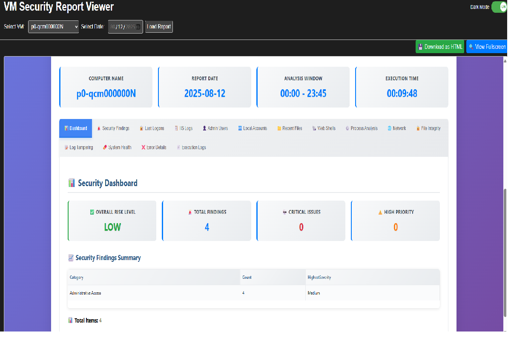

# mini DFIR - Threat Analysis Report Tool

A comprehensive Azure-based security monitoring and threat analysis solution for Windows virtual machines with automated deployment, centralized reporting, and web dashboard visualization.

## 🔧 **Tech Stack**
- **Language**: PowerShell
- **Cloud Platform**: Microsoft Azure
- **Storage**: Azure Blob Storage with Static Website hosting
- **Automation**: Azure Automation Runbooks
- **Deployment**: Azure VM Run Command
- **Web Interface**: HTML/CSS/JavaScript

## 👨‍💻 **Creator**
**Darwin Galao** - Security Engineer & PowerShell Developer

## 📋 **Project Overview**

The Threat Analysis Report Tool provides enterprise-grade security monitoring for Windows virtual machines through automated deployment and continuous threat detection. The solution creates a complete security pipeline from deployment to visualization, offering IT security teams comprehensive visibility into their VM environments.

## 🏗️ **Architecture Flow**


## 🚀 **Initial Setup Flow**

1. **📦 Create Azure Storage Account** - Enable static website hosting for the dashboard
2. **🤖 Deploy Azure Automation Runbook** - Automated script deployment to target VMs
3. **⏰ Schedule Security Analysis** - Scripts run on specified schedule (daily at 23:45)
4. **📊 Dashboard Visualization** - Static site displays available VMs and report dates

## 📁 **Project Structure**

```
Threat Analysis Report/
├── azure-automation-runbook/
│   ├── rb-run-security-baseline-report.ps1    # Azure Runbook for VM deployment
│   └── hostguard.ps1                          # VM setup and configuration script
├── ps-scripts/
│   ├── sec-baseline-audit.ps1                 # Core security analysis engine
│   └── upload-sec-report.ps1                  # Report upload handler
├── web-assets/
│   ├── index.html                             # Dashboard web interface
│   ├── 404.html                               # Error page
│   └── vm-list.json                           # VM configuration file
└── README.md                                  # This file
```

## 🔍 **Core Components**

### **1. Azure Automation Runbook (`rb-run-security-baseline-report.ps1`)**
- **Purpose**: Orchestrates deployment to target VMs using Azure VM Run Command
- **Features**: 
  - Managed Identity authentication
  - Support for single VMs and VM Scale Sets
  - Automated script download and deployment
  - Comprehensive error handling and logging

### **2. HostGuard Setup Script (`hostguard.ps1`)**
- **Purpose**: Initializes target VMs with security monitoring capabilities
- **Features**:
  - Downloads security analysis and upload scripts from Azure Storage
  - Creates scheduled tasks for automated execution
  - System requirements validation
  - UTF-8 encoding preservation
  - Comprehensive logging and retry mechanisms

### **3. Security Analysis Engine (`sec-baseline-audit.ps1`)**
- **Purpose**: Performs comprehensive threat detection and security analysis
- **Analysis Capabilities**:
  - 🔐 Last Logon Events Analysis
  - 📋 Enhanced IIS Log Analysis
  - 👤 Administrative Users Monitoring
  - 🆕 Local Account Management
  - 📁 Recent File Analysis
  - 🐚 Advanced Web Shell Detection
  - ⚙️ Process Analysis
  - 🌐 Network Connections Monitoring
  - 🔒 File Integrity Monitoring
  - 📝 Log Tampering Detection
  - 💊 System Health Checks

### **4. Report Upload Handler (`upload-sec-report.ps1`)**
- **Purpose**: Securely uploads generated reports to Azure Blob Storage
- **Features**:
  - AzCopy integration for efficient transfers
  - Report metadata management
  - Retry logic and error handling
  - Automated cleanup based on retention policies

### **5. Web Dashboard (`index.html`)**
- **Purpose**: Provides centralized web interface for security report access
- **Features**:
  - VM selection and report browsing
  - Dark/Light mode toggle
  - Responsive design for mobile access
  - Real-time report availability checking

## 📊 **Security Analysis Features**

### **🚨 Threat Detection Categories**

| Category | Severity Levels | Detection Method |
|----------|----------------|------------------|
| **Web Attacks** | Critical/High/Medium | IIS log pattern matching, signature analysis |
| **Suspicious Logons** | High/Medium | Event log analysis with risk scoring |
| **Administrative Access** | Medium/Low | User activity monitoring and privilege escalation detection |
| **File Modifications** | Variable | Hash-based integrity monitoring with timeline analysis |
| **Web Shell Detection** | Critical | Advanced pattern matching for PHP, ASP, and generic shells |
| **Process Anomalies** | High/Medium | Process behavior analysis and suspicious activity detection |
| **Network Threats** | Variable | Connection pattern analysis and unusual traffic detection |
| **Log Tampering** | Critical | Security log integrity monitoring and modification detection |

### **📈 Report Generation**
- **Interactive HTML Dashboard**: Professional, responsive web interface
- **15+ Analysis Sections**: Comprehensive coverage of security domains
- **Real-time Filtering**: Search and filter capabilities within reports
- **Executive Summary**: High-level findings for management reporting
- **Technical Details**: Comprehensive information for security analysts

## ⚙️ **Configuration & Deployment**

### **Prerequisites**
- Azure subscription with appropriate permissions
- Azure Automation Account with Managed Identity
- Azure Storage Account with static website enabled
- Target Windows VMs with PowerShell 5.1+
- Network connectivity between Azure services and target VMs

### **Deployment Steps**

1. **🔧 Configure Azure Storage**
   ```bash
   # Enable static website hosting
   # Upload web-assets to $web container
   # Configure blob storage containers
   ```

2. **📜 Deploy Automation Runbook**
   ```powershell
   # Import rb-run-security-baseline-report.ps1 to Azure Automation
   # Configure Managed Identity permissions
   # Set up runbook parameters
   ```

3. **🎯 Execute Deployment**
   ```powershell
   # Run automation runbook targeting specific VMs or VM Scale Sets
   # Monitor deployment logs and verify installation
   ```

4. **📊 Access Dashboard**
   ```
   # Navigate to static website URL
   # Select target VMs and review security reports
   ```

### **Configuration Parameters**

#### **Azure Automation Runbook Parameters**
- `ResourceGroupName`: Target resource group containing VMs
- `VMName`: Specific VM name (for single VM deployment)  
- `VMSSName`: VM Scale Set name (for scale set deployment)
- `InstanceID`: Specific instance ID within VM Scale Set
- `TargetSubscription`: Azure subscription ID

#### **Storage Configuration**
- Primary storage account for script hosting
- Secondary storage account for report storage
- Static website hosting configuration
- SAS token configuration for secure access

## 📱 **Dashboard Interface**

### **Sample Dashboard**

*Screenshot showing the web dashboard interface with VM selection, report browsing, and dark mode toggle*

### **Dashboard Features**
- **📋 VM List**: Dynamic loading of available virtual machines
- **📅 Date Selection**: Browse reports by date range
- **🌓 Theme Toggle**: Light and dark mode support
- **📱 Responsive Design**: Mobile-friendly interface
- **🔍 Search & Filter**: Real-time filtering of security findings
- **📊 Status Indicators**: Visual indicators for report availability and VM health

## 🔐 **Security Considerations**

### **Access Control**
- Managed Identity authentication for Azure services
- SAS token-based storage access with expiration
- Principle of least privilege for all service accounts
- Network security groups for traffic filtering

### **Data Protection**
- Encryption in transit for all Azure communications
- Encryption at rest for stored security reports
- Secure deletion of temporary files and credentials
- Audit logging for all administrative actions

### **Monitoring & Alerting**
- Azure Monitor integration for service health
- Alert rules for failed deployments or analysis
- Retention policies for log and report management
- Regular access reviews and permission audits

## 📈 **Performance & Scalability**

### **Optimization Features**
- Parallel processing for large file analysis
- Configurable analysis time windows
- Efficient report compression and storage
- Automated cleanup and retention management

### **Scalability Considerations**
- Support for VM Scale Sets and large environments
- Distributed analysis across multiple time zones
- Load balancing for web dashboard access
- Storage partitioning for high-volume environments

## 🔧 **Maintenance & Troubleshooting**

### **Regular Maintenance Tasks**
- Review and update threat detection signatures
- Monitor storage usage and costs
- Update PowerShell modules and dependencies
- Review and rotate SAS tokens and access keys

### **Common Troubleshooting**
- **Deployment Failures**: Check VM connectivity and permissions
- **Report Upload Issues**: Verify storage account access and SAS tokens
- **Analysis Errors**: Review PowerShell execution policies and dependencies
- **Dashboard Access Issues**: Confirm static website configuration and DNS

## 📝 **Version History**

- **v5.1**: Enhanced threat analysis with improved web shell detection
- **v4.0**: Added Azure Automation integration and VM Scale Set support
- **v3.0**: Introduced web dashboard and static site hosting
- **v2.0**: Added centralized reporting and Azure Storage integration
- **v1.0**: Initial security baseline audit functionality

## 🤝 **Contributing**

Contributions are welcome! Please feel free to submit issues, feature requests, or pull requests.

### **Development Guidelines**
- Follow PowerShell best practices and coding standards
- Include comprehensive error handling and logging
- Test all changes in isolated environments
- Update documentation for new features or changes
- Maintain backward compatibility where possible

## 📜 **License**

This project is open source and available under the [MIT License](LICENSE).

## 📞 **Support**

For questions, issues, or feature requests, please:
- 📧 Open an issue in this repository
- 💬 Contact the development team
- 📖 Review the documentation and troubleshooting guides

## 🙏 **Acknowledgments**

Special thanks to the security community for threat intelligence and detection patterns, and to the PowerShell community for best practices and module development.

---

**Built with ❤️ by Darwin Galao**  
*Making enterprise security monitoring accessible and automated*
